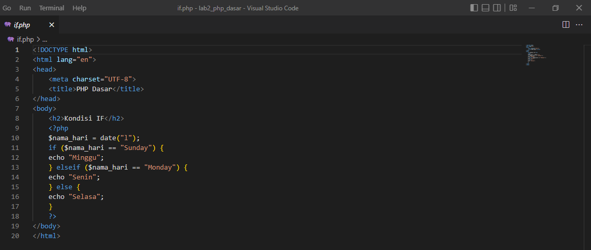

# Lab2Web

## PRAKTIKUM: PHP DASAR

Nama: Alvina Damayanti
Kelas: TI.21.A.3
Nim: 312110125

## 1. Install XAMPP

Unduh XAMPP dari https://www.apachefriends.org/download.html dan pilih versi portable untuk memudahkan proses installasi. Kemudian extract file tersebut, seusikan direktorinya (misal: C:\xampp).

## 2. Menjalankan Web Server

## 3. Memulai PHP

Buat folder lab2_php_dasar pada C:\xampp

Kemudian untuk mengakses direktory tersebut pada web server dengan mengakses URL: http://localhost/lab2_php_dasar/

## 4. PHP Dasar

Buat file baru dengan nama php_dasar.php pada directory tersebut. Kemudian buat kode seperti berikut.

Hasil Output:

## 5. Variabel PHP

Menambahkan variabel pada program

Hasil Output:

## 6. Predefine Variabel $_Get

Dibuat dengan nama file latihan2.php dan source code seperti:

Untuk mengaksesnya gunakan URL: http://localhost/lab2_php_dasar/latihan2.php?nama=Vina

Hasil Output:

## 7. Membuat Form Input

Dibuat dengan nama file input.php dan source code seperti:

Hasil Output:

## 8. Operator

Dibuat dengan nama file operator.php dan source code seperti:

Hasil Output:

## 9. Kondisi IF

Dibuat dengan nama file if.php dan source code seperti:

Hasil Output:

## 10. Kondisi Switch

Dibuat dengan nama file switch.php dan source code seperti:

Hasil Output:

## 11. Perulangan For

Dibuat dengan nama file for.php dan source code seperti:

Hasil Output:

## 12. Perulangan While

Dibuat dengan nama file while.php dan source code seperti:

Hasil Output:

## 13. Perulangan Dowhile

Dibuat dengan nama file do_while.php dan sorce code seperti:

Hasil Output:

## 14. Praktikum

Membuat program PHP sederhana dengan menggunakan form input yang menampilkan nama, tanggal lahir dan pekerjaan. Kemudian menampilkan outputnya dengan menghitung umur berdasarkan inputan tanggal lahir. Dan pilihan pekerjaan dengan gaji yang berbeda-beda sesuai pilihan pekerjaan.

Dibuat dengan nama file index.php dan source code seperti:

Hasil Output:

